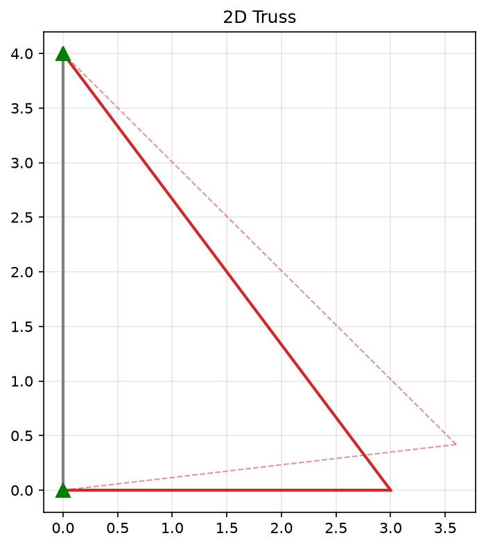

# 🏗️ Truss Analysis 2D

> **A scientific 2D truss analysis tool with thermodynamic validation.**

[](https://github.com/bmhmdyan279-png/truss-analysis-2d/actions/workflows/ci.yml)
[](https://github.com/bmhmdyan279-png/truss-analysis-2d)
[](LICENSE)
[](https://www.python.org/downloads/)

---

## 📦 Installation

### From Source (Recommended)

```bash
git clone https://github.com/bmhmdyan279-png/truss-analysis-2d.git
cd truss-analysis-2d
pip install -e ".[dev]"
```

### Quick Verification

```bash
# Run all tests
pytest

# Run a quick example
truss-analysis examples/example1.json
```

---

## 🚀 Quick Start

### CLI Usage

```bash
# Basic analysis
truss-analysis input.json

# With multiple outputs
truss-analysis input.json --output result.json --csv forces.csv --report report.md

# With visualization and buckling check
truss-analysis input.json --plot --check-buckling --plot-path diagram.png
```

### Python API

```python
from truss_analysis.main import run

# Run analysis
result = run("input.json", check_buckling=True)

# Access results
print(result.summary())
print(f"Displacements: {result.displacements}")
print(f"Element forces: {result.element_forces}")
print(f"Reactions: {result.reactions}")
print(f"Equilibrium valid: {result.equilibrium['is_valid']}")
```

---

## 🖼️ Visual Output Example

Below is a sample visualization generated using the `--plot` flag. The dashed lines represent the deformed shape, while the solid lines show the original truss geometry. Colors indicate element stress states (tension in blue, compression in red).



*Deformed vs. original shape for `examples/example1.json`*

## 📖 Input JSON Format

```json
{
  "units": "SI",
  "nodes": [
    {"id": 1, "x": 0.0, "y": 0.0, "is_support": true, "support_dx": true, "support_dy": true},
    {"id": 2, "x": 3.0, "y": 0.0, "is_support": false},
    {"id": 3, "x": 0.0, "y": 4.0, "is_support": true, "support_dx": true, "support_dy": true}
  ],
  "elements": [
    {"id": 1, "node_i": 1, "node_j": 2, "E": 200e9, "A": 0.001},
    {"id": 2, "node_i": 2, "node_j": 3, "E": 200e9, "A": 0.002},
    {"id": 3, "node_i": 1, "node_j": 3, "E": 200e9, "A": 0.0015}
  ],
  "loads": [
    {"node_id": 2, "Fx": 10000.0, "Fy": -5000.0}
  ]
}
```

## 📤 Output Format

### JSON Output Structure
```json
{
  "status": "converged",
  "displacements": {
    "2": {"dx": 0.00234, "dy": -0.00567}
  },
  "element_forces": [
    {
      "id": "1",
      "N": 15234.5,
      "status": "tension",
      "sigma": 15.23e6,
      "strain": 7.6e-5
    }
  ],
  "reactions": {
    "1": {"Fx": -8000.0, "Fy": 3500.0}
  },
  "equilibrium": {
    "sum_fx": 1.2e-10,
    "sum_fy": 3.4e-11,
    "is_valid": true
  }
}
```

### Units
All outputs are in SI units:
| Quantity | Unit |
|----------|------|
| Displacement | m |
| Force | N |
| Stress | Pa |

### Optional Element Parameters

| Parameter | Description | Unit |
|-----------|-------------|------|
| `alpha` | Thermal expansion coefficient | 1/°C |
| `delta_T` | Temperature change | °C |
| `delta_L_free` | Free length change | m |
| `I_sec` | Moment of inertia (for buckling) | m⁴ |
| `rho` | Density (for self-weight) | kg/m³ |

---

## 🎯 Key Features

### 1. Scientific Accuracy
- **Generalized Clapeyron theorem:** `W_mech = U_strain + 0.5 * W_prestress`
- **Effect separation:** `δL_mech = δL_total - δL_prestress`
- **Static equilibrium:** ΣFx=0, ΣFy=0, ΣM=0
- **Mechanism detection:** Singular matrix error

### 2. Engineering Capabilities
- **Euler buckling:** `P_cr = π²EI/L²` for compression members
- **Slenderness ratio:** `λ = L/r` with `r = √(I/A)`
- **Self-weight:** From element density
- **SI/Imperial units:** Automatic conversion

### 3. Output Formats
- **JSON:** Complete structured results
- **CSV:** Element forces
- **Markdown:** Human-readable report
- **Plot:** Original and deformed truss

---

## 🧪 Testing

```bash
# Run all tests
pytest

# With coverage report
pytest --cov=src/truss_analysis --cov-report=term-missing

# Current status: 39 tests, 90.5% coverage
```

---

## 🤝 Contributing

Contributions are welcome! Please see [CONTRIBUTING.md](CONTRIBUTING.md) for guidelines.

```bash
# Development setup
git clone https://github.com/bmhmdyan279-png/truss-analysis-2d.git
cd truss-analysis-2d
pip install -e ".[dev]"
pre-commit install
pytest
```

---

## 📚 Citation
If you use this software in your research, please cite:

```bibtex
@software{truss_analysis_2d,
  author = {bmhmdyan279-png},
  title = {Truss Analysis 2D: Scientific Truss Solver},
  year = {2026},
  url = {https://github.com/bmhmdyan279-png/truss-analysis-2d},
  version = {2.4.0}
}
```

---

## 📄 License

This project is licensed under the MIT License — see [LICENSE](LICENSE) for details.

---

## 🙏 Acknowledgments

- **NumPy** for matrix computations
- **Matplotlib** for visualization
- **SciPy** for sparse matrix operations
- **Pytest** for testing framework
- **Ruff** for linting and formatting
- **setuptools_scm** for automatic versioning
